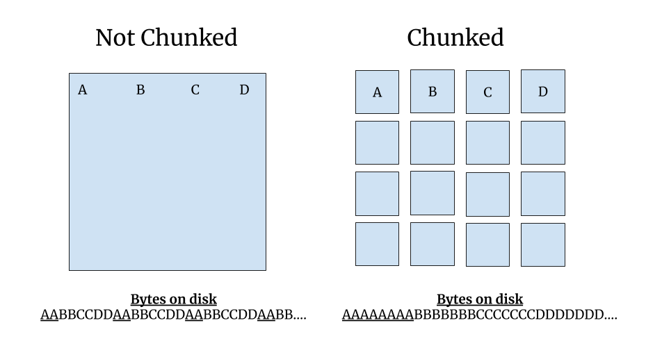
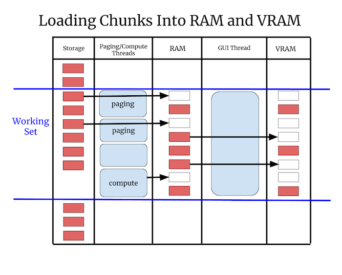
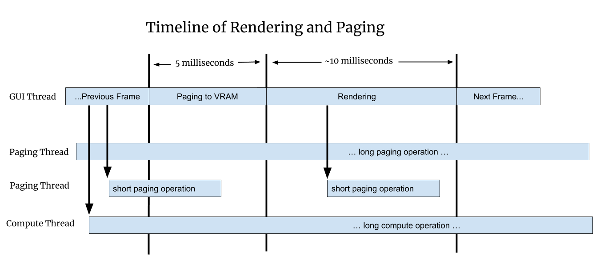
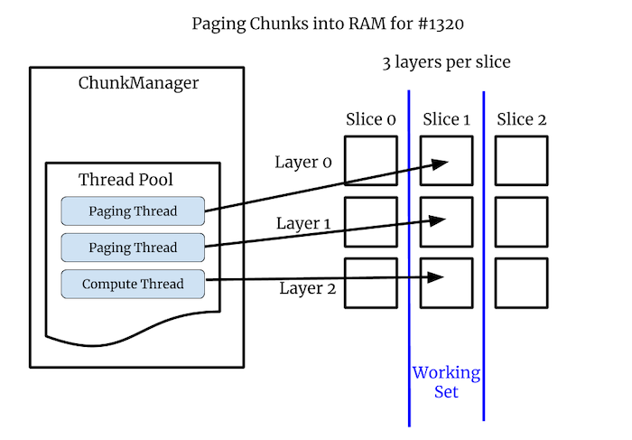

# Overview

This document outlines our plans for making napari's rendering non-blocking. We
hope to update this document as we progress so it can be an accurate record of
the final implementation.

# Blocked UI

In May 2020 we looked into these three issues related to napari's blocked UI:

| Issue                                                 | Summary                                                              |
| ----------------------------------------------------- | -------------------------------------------------------------------- |
| [#845](https://github.com/napari/napari/issues/845)   | UI blocked by Disk or Network IO while rendering multi-scale images. |
| [#1300](https://github.com/napari/napari/issues/1300) | UI blocked while rendering large in-memory images (not multi-scale). |
| [#1320](https://github.com/napari/napari/issues/1320) | UI blocked while rendering small images due to lazy computations.    |

When the UI is "blocked" napari feels slow and lags. It's not just an aesthetic
issue, manipulation of interactive UI elements like sliders becomes nearly
impossible if the framerate is low enough. Blocking can even lead to the
"spinning wheel of death" on Macs indicating the application is hung.

Napari is very extensible and customizable and users can create what amounts to
custom applications built on top of napari. In those cases a blocked UI doesn't
just hamper viewing images, it can take down their entire application. For all
of these reasons we never want napari's GUI thread to block.

# Framerate

Most screens refresh at 60Hz and ideally GUI applications draw at the same
speed. If 60Hz cannot be achieved the application should draw as fast as
possible. Slow framerates lead to bad user experiences:

| Framerate | Milliseconds | User Experience |
| --------- | ------------ | --------------- |
| 60Hz      | 16.7         | Great           |
| 30Hz      | 33.3         | Good            |
| 20Hz      | 50           | Acceptable      |
| 10Hz      | 100          | Bad             |
| 5Hz       | 200          | Unusable        |

Even if the average rate is fast, applications are called
[janky](http://jankfree.org/) if their framerate jumps around. Even one slow
frame can be annoying to the user. We want napari's average framerate to be high
but we also want the framerate to be as consistent as possible.

# Array-like Interface

Napari renders data out of an "array-like" interface, it can use any object that
supports `numpy`'s slicing syntax. This is a powerful abstraction, but the
flexibility creates a huge challenge for napari. Many graphics applications have
specific and customized data formats, but napari needs to work with basically
any source of data.

With [Dask](https://dask.org/) or custom code it's possible an array access will result in disk
or network IO. It's even possible the data does not exist at all and it will be
computed on-the-fly. In this case the user's code is doing the computation and
napari has no control or visibility into the computation or how long it will
take.

In [#845](https://github.com/napari/napari/issues/845) the array access leads to
loading data from disk or over the network. In
[#1320](https://github.com/napari/napari/issues/1320) the array access leads to
a machine learning calculation with Torch. In
[#1300](https://github.com/napari/napari/issues/1300) the problem is different.
There the data is already entirely in memory, but it's not chunked. Today that
means we transfer 100's of MB to the card in one shot and this blocks the UI. We
can't allow huge monolithic arrays of data in napari. Everything must be broken
down into reasonably sized chunks.

# Requirements

In order to never block the GUI thread we need to do two things:

1. Always break data into chunks. The exact maximum chunk size is TBD.
2. Never call `asarray` on user data from the GUI thread since we don't know
   what it will do or how long it will take.

# Render Algorithm

The renderer will compute the **working set** based on the current view. The
working set is the set of chunks that we need to draw to fully render that
specific view. The renderer will step through every chunk in the working set and
do one of three things:

| Case                         | Action                                      |
| ---------------------------- | ------------------------------------------- |
| Chunk is in VRAM             | Render the chunk                            |
| Chunk is in RAM but not VRAM | Transfer the chunk to VRAM if there is time |
| Chunk is not in RAM          | Ask the `ChunkManager` to load the chunk    |

If a chunk cannot be drawn a placeholder will be drawn instead. What we draw as
a placeholder is TBD and it may vary depending on the situation. In some cases
we might be able to draw a lower resolution version of the data, which can be
refined later as more data is available. In the worst case we might have to draw
a blank grid or a loading animation.

The important thing about this algorithm is it never blocks. It draws what it
can and works on getting more stuff to be drawable next time.

# Chunks

**Chunks** is a deliberately vague term. For our purpoases *a chunk is data used
to render a portion of the scene*. Without chunks we have only two choices:
render nothing or render the entire scene. With chunks we can partially render
the scene using whatever chunks are currently available, and we can
progressively add more chunks as more data is loaded.

Progressive rendering is valuable because the user can often navigate or make
other decisions with partially loaded data, so the user can work faster. Also
progressive rendering just feels more pleasant for the user. Progressive rending
makes the internal state of the application visible which is often leads to a
better user experience.

## Chunked File Formats

The most common types of chunks are blocks of contiguous memory inside a chunked
file format like **Zarr** and exposed by an API like **Dask**. If an image is
stored without chunks then reading any given small 2D region of the image
requires many different read operations. The bytes for that region are spread
throughout the file, intermingled with the bytes from other regions. With
chunking you can read a rectangular region with a single read operation.

For 3D images the chunks tend to be 3D blocks, but the idea is the same.
[Neuroglancer](https://opensource.google/projects/neuroglancer) commonly stores
data in 64x64x64 voxel chunks which is 256,000 voxels per chunk. This is useful
because you can view the data in XY, XZ or YZ orientations and it performs just
as well in each case. It's also nice because you can scroll through slices quickly
since on average you have 32 slices above and below your current location.

## Creating Chunks

In [#1300](https://github.com/napari/napari/issues/1300) there are no chunks
since the images were created in memory as one monolithic array. To solve
[#1300](https://github.com/napari/napari/issues/1300) we are going to have to
break that array into chunks, so we can send the data to the graphics card
incrementally. In [#1320](https://github.com/napari/napari/issues/1320) the
images are small so they are not chunked, but there are 3 image **layers** per
slice. In that case the *image layers are our chunks*. In general we can get
creative with chunks, they can be spatial or non-spatial subdivisions, basically
anything we want. As long as the things can be loaded and drawn independently
we can use them as chunks.

# Loading into RAM and VRAM

There is a two step process to get data into VRAM where we can draw it. First it
needs to be loaded into RAM and then transferred into VRAM. Loading into RAM
must be done in a thread since we don't know how long it will take. For example
loading data over the internet or doing a complex calculation to produce the
data could both take a really long time.

Loading into VRAM is a different story because it must happen in the GUI thread,
at least with OpenGL. Therefore we need to amortize the load over some number of
frames. We will set a budget, for example 5 milliseconds. Each frame can spend
up to that much time loading data into VRAM before it starts drawing. It's
important that no single chunk takes more than 5 milliseconds to transfer,
otherwise we will definitely go over our budget transferring that chunk.

When the rendering process is viewed as a timeline, the rendering thread has
regularly spaced frames, while the IO and compute threads load data into RAM in
parallel. When a paging/compute operation finishes it puts the data into RAM and
marks it as available, so the renderer can use it during the next frame.

# Example: #1320

In [#1320](https://github.com/napari/napari/issues/1320) the images are not
chunked since they are very small, but there are 3 layers per slice, so these
per-slice layers are our chunks. Some layers are coming off disk while some are
computed. The "working set" is the set of chunks we need to draw the full
current scene. In this case we need the visible layers for the current slice.

# Example: #845

In [#845](https://github.com/napari/napari/issues/845) we are drawing a
multi-scale image which is chunked on disk.

## Chunk Size

It's confusing but there can be different chunk sizes in play at one time.
**Dask** chunks are often larger than the file format's chunks. This means
loading one Dask chunk will cause many disk chunks to load. We might set our
rendering chunks to be the same size that Dask is using, if we can even
determine that, or we might chose a different size.

In the end there are two different types of speed: framerate and load time. As
long as the chunk size is not too big we should be able to get a good framerate.
However loading speed can be trickier and can depend on many factors. Sometimes
there is a tradeoff, perhaps we can speed up loading by slowing the framerate a
bit. Hopefully we can come up with defaults that work well for most situations,
but we'll probably need to provide a way for the user to tune the chunk size and
other parameters if necessary.

## Octree

To solve [#1320](https://github.com/napari/napari/issues/1320) our chunks will
be layers. The ChunkManager can write the data into the `Image` object for those
layers. However with [#845](https://github.com/napari/napari/issues/845) chunks
are spatial so we need a new spatial datastructure that can keep track of which
chunks are in memory and store the per-chunk data. We are going to use an
octree. See
[Apple's](https://developer.apple.com/documentation/gameplaykit/gkoctree) nice
illustration of an octree:

In a quadtree every square node is divided into 4 children representing the 4
spatial quadrants of that node: upper-left, upper-right, lower-left and
lower-right. An octree is the same idea but in 3D: every node has up to 8 children,
the 4 on top and the 4 on the bottom.

We can use our octree for 2D situations just by restricting ourselves to the top
4 children. So we plan to always use the same octree datastructure, but use it
for both 2D and 3D situations.

## Multi-resolution

Like image pyramids the octree can store many versions of the same data at
different resolutions. The root node contains a downsampled depiction of the
entire dataset. As the user zooms in, we descend into child nodes which contain
ever smaller portions of the data, but at ever higher resolutions.

In either case if a chunk is not in memory it will be requested from the
`ChunkManager`. Until the data is in memory the renderer will draw a
placeholder. In many cases the best placeholder will be from a different level
of the octree. This will produce the familiar effect where the image is
initially blurry but then "refines" as more data is loaded. In the worst case if
no stand-in is available the placeholder can be a blank grid, potentially with
some sort of "loading" animation.

## Beyond Images

We are starting with 2D images but we are going to build the `ChunkManager` and
octree in a generic way so that we can add in more layer types over time,
including 3D images, points, shapes and meshes. 2D images are the simplest case,
but we believe most of the infrastructure we create can be used by the other
layer types as well.

There are several reasons the other layer types might be harder than 2D images:

1. Downsampling images is fast and well understood but "downsampling" geometry
   can be slow and complicated. Plus this is no one definitive result, there
   will be complicated trade-offs for speed and quality.
2. Sometimes we will to want downsample versions of things into a format that
   represents the data but does not look like data. For example instead of
   seeing millions of tiny points, the user might want to see a heatmap or
   bounding boxes indicating where the points are. Many different types of
   aggregation are possible and we will need to experiment and get user
   feedback.
3. With images the data density is uniform but with geometry it can vary
   drastically. You can pack in millions of points/shapes/triangles into a tiny
   area. This taxes spatial subdivision schemes and might require other
   solutions.

Luckily we don't need to solve all of these problems to start. We will start
with 2D images and grow from there. We can render asymmetrically with an octree
for one layer time but no octree for another. Or we could start using an octree
with a new layer type but start with a very simplistic downsampling scheme that
we can improve over time. So we can incrementally improve the rendering system.

## Implementation Plan

We will resolve [#1320](https://github.com/napari/napari/issues/1320) first:

1.  Create a `ChunkManager` class that uses a `@thread_worker` thread pool.
2.  Introduce a `DataSource` class whose data may or may not be in memory.
3.  The paging thread will put its data into `DataSource` and trigger a `draw()`.
4.  Probably `_set_view_slice`  will become just `draw()` and it will draw
    chunks it can and page/request the chunks that it needs.
5.  Figure out how we set the size of the thread pool.
  
With [#1320](https://github.com/napari/napari/issues/1320) resolved the next big
step will be creating an octree and the related infrastructure to take on
[#845](https://github.com/napari/napari/issues/845) and
[#1300](https://github.com/napari/napari/issues/1300). Once more is known about
the octree we will document it here.

# Appendix

## A. Number of Worker Threads

How many worker threads should we have? The challenge is the optimal numbers of
threads will depend on the workload, but we don't know what's going on behind
the array-like interface. Some possible workloads:

| Workload                | Optimal Number Of Threads                      |
| ----------------------- | ---------------------------------------------- |
| Local IO                | Depends on the device and the access patterns. |
| Networked IO            | A large number since setup costs are large.    |
| Small Compute (1 core)  | Probably want one thread per available core.   |
| Big Compute (all cores) | Maybe we want just one thread total.           |

We will probably try to aim for "reasonable defaults which yield reasonable
performance". If necessary we might have ways for the user to configure the
number of threads. A fancy thing would be try to infer what's going on and
adjust the number of threads dynamically ourselves.

## B. Threads, Processes and `asyncio`

Hopefully we can stick with threads for parallelism. However in Python threads
cannot run completely independently of each other due to the [Global Interpreter
Lock
(GIL)](https://medium.com/python-features/pythons-gil-a-hurdle-to-multithreaded-program-d04ad9c1a63).
Luckily in many cases a thread will release the GIL to do IO or
compute-intensive operations. During those spans of time the threads *can* run
independently.

The GIL only applies to threads that are actively running Python bytecode. Only
one thread can be executing bytecode at a time. The GIL makes Python threads
safer to use than threads in many languages. In Python two threads can in many
cases access the same datastructure without a lock because the GIL serves as
kind of a universal lock for all datastructures.

If we threads interfere too much we might consider switching to processes in
those cases. Processes ofter total independence, but processes do not share
memory by default, so that might add complexity.

Python also has [asyncio](https://docs.python.org/3/library/asyncio.html) which
gives you concurrency but not necessarily parallelism. The advantage is the
concurrent tasks are much lighter weight than threads. In some languages you can
have millions of concurrent tasks. `asyncio` is relatively new and we should
keep it in mind for rendering and other purposes.

## C. VRAM and Vispy

With OpenGL you cannot directly manage VRAM. Instead we will control what's in
VRAM by creating and drawing [vispy](http://vispy.org/) objects. By drawing
objects in our working set VRAM will soon contain what we want. We will tightly
manage the construction and destruction of vispy objects to match the current
working set. We also have to make sure that we don't create too many new objects
in one frame which could cause us to exceed our time budget.

This document does not get into vispy only because we don't know those details yet.