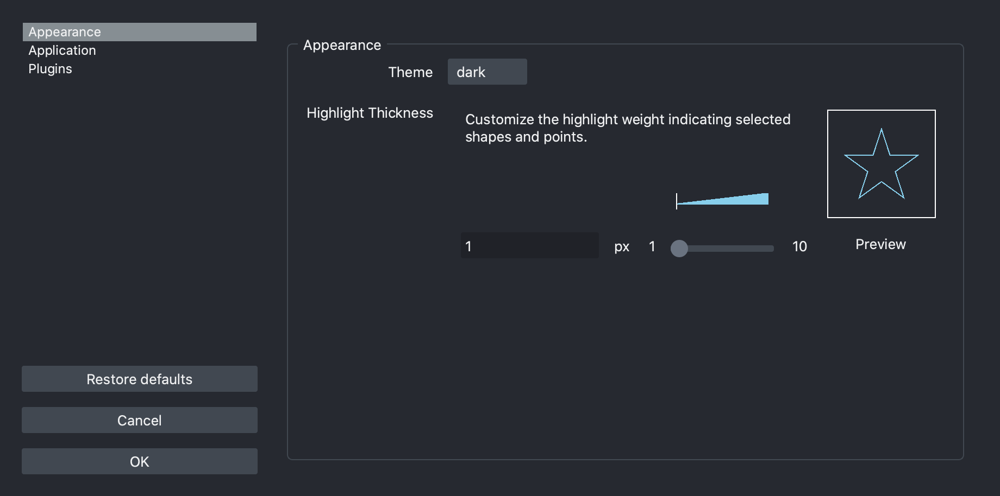
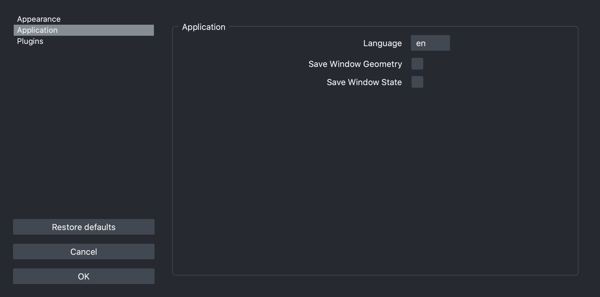
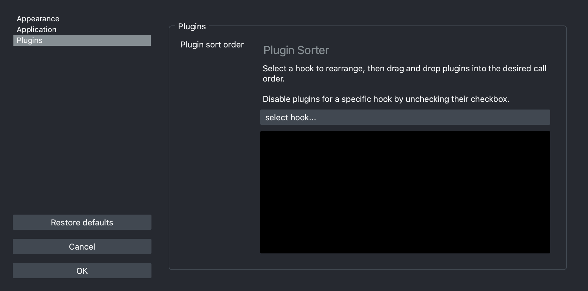
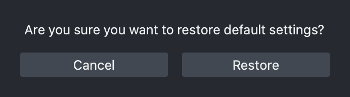

(preferences)=

# Preferences

Starting with version 0.4.7, napari codebase include internationalization
(i18n) and now offers the possibility of installing language packs, which
provide localization (l10n) enabling the user interface to be displayed in
different languages.

## Sections

### Appearance

Appearance Settings.


- **None** *(highlight_thickness)*: Customize the highlight weight indicating selected shapes and points. (Default: `1`).
- **Theme** *(theme)*: Theme selection. (Default: `'dark'`).

### Application

Main application settings.


- **None** *(console_notification_level)*: None (Default: `<NotificationSeverity.NONE: 'none'>`).
- **None** *(gui_notification_level)*: None (Default: `<NotificationSeverity.INFO: 'info'>`).
- **IPython interactive** *(ipy_interactive)*: Use interactive %gui qt event loop when creating napari Viewers in IPython (Default: `True`).
- **Language** *(language)*: Interface display language. (Default: `'en'`).
- **Save Window Geometry** *(save_window_geometry)*: Save window size and position. (Default: `True`).
- **Save Window State** *(save_window_state)*: Save window state of dock widgets. (Default: `True`).
- **None** *(window_fullscreen)*: None (Default: `None`).
- **None** *(window_maximized)*: None (Default: `None`).
- **None** *(window_statusbar)*: None (Default: `True`).

### Plugins

Plugins Settings.


- **Plugin sort order** *(call_order)*: Sort plugins for each action in the order to be called. (Default: `None`).

## Reset to defaults

### Using the UI

Click on the `Restore defaults` button.



### Using the CLI

```bash
napari --reset
```

## Changing settings programmatically

```python
from napari.utils.settings import SETTINGS

SETTINGS.appearance.theme = "light"
```

