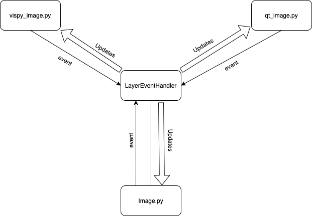

# Event Handling in napari

This document outlines the event handling in napari, and includes some
description of napari's overall architecture, such as its separation of
models and views. We are currently in the process of refactoring the code
to have a centralized event handling system and this document will be updated
to reflect the latest progress. Some of the document is written from an
aspirational perspective of where we'd like napari to be after this refactor
is complete.

## Overview of Models, Views, Events, and Event Handlers

napari is architected to have a strict separation of its model code and its 
view code.

- **models** directly manages data, logic, and rules of within napari,
independent of any user interface and emit updates to an event handler via
events.

- **views** contain a representation of information from a model and route
user commands to an event handler via events.

- **events** are emitted from both views and models in napari and all flow
through centralized event handlers.

- **event handlers** connect the models and views by receiving events and
acting upon them to update the models and views.



For example the above diagram shows the flow of information for the ```Image```
layer model, and two views, one ```VisPy``` based and one ```Qt``` based that
are all being connected via an event handler. 

This architecture is probably most similar to the [model-view-presenter](https://en.wikipedia.org/wiki/Model%E2%80%93view%E2%80%93presenter) architecture. A unique aspect of napari
that distinguishes it from other GUI applications is that advanced users expect 
to be able to interact directly with the napari model from interactive
environments like ```IPython``` and ```Jupyter``` and to use napari models
headless, without any views when performing batch analysis. This feature forces
us to put more logic into our model files so that they can be used stand-alone.

Right now napari just supports one front-end, built using [Qt](https://www.qt.io/),
and one rendering library using [VisPy](http://vispy.org/), but in the future
we might expand to support other web-based front-ends or other rendering
libraries. At that point we'd have to replace our view code but we'd want to
preserve our model code. A clear sign of a good separation of concerns is 
that there should be not Qt code imported into any of the napari model files.

## The Event System

napari has vendored the event system from ```VisPy``` which is documented
[here](http://vispy.org/util.html#module-vispy.util.event) and is largely
unchanged. 

Each **model** or **view** is capable of having an ```EventEmitterGroup```
connected to an ```EventHandler``` that contains various named ```EventEmitter```
objects, each of which is capable of emitting events that can carry a single
value as a payload. For example you can emit a custom colormap string from
the ```colormap``` emitter as follows:

```python
layer.events.colormap('my_colormap')
```

If this ```EventEmitterGroup``` was connected to an ```EventHandler``` then
the ```EventHandler``` will receive this event and its payload and then will
call any corresponding update methods on any object that has been registered
as a listener. Update methods are linked to particular emitters via a naming
convention ```_on_*change``` where the ```*``` corresponds to the name of the
emitter, ```colormap``` in the example above. These update methods take one
variable as an input argument, which is always the payload carried by its
corresponding event.

This event system allows us to have a loose coupling between our models and
views but ensures that information never gets out of sync or gets into circular
updating patterns. 

As we expect napari users to be able to interact with our model object directly
we use ```setters``` on our attributes to emit events and ```_on_*_change```
methods to actually perform updates. When instantiating our models the
necessary event handlers are created and attached to them so that they can
be used without additional imports. The separation of our setters, event
emission and actual updates ensures that we don't have circular flows where
values are being constantly updated and emitted.
